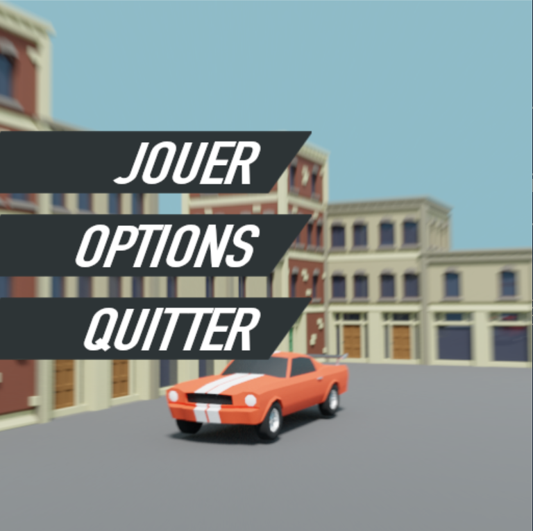
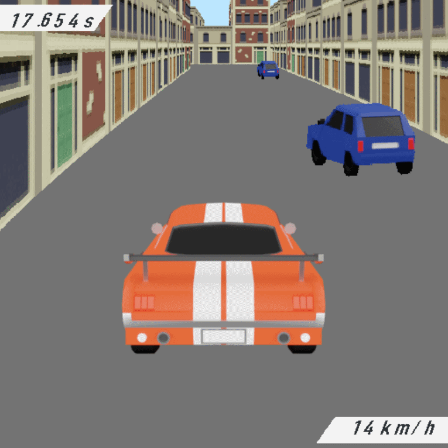

# raycast_racer

**Projet universitaire Semestre 3**

**Théo JOFFROY**

https://github.com/tojry/raycast_racer

***

# Compilation :
* Windows :  
Renommer le fichier **Makefile_win** en **Makefile** en remplacant le fichier **Makefile** déjà existant  
**mingw32-make** depuis le dossier du projet

* Linux :  
**make** depuis le dossier du projet.

Exécution : **./main**

Libs nécessaires : -lSDL2_ttf  -lSDL2_image

***

# Manuel d’utilisation du jeu :

Jeu de course de voitures en 3D.
L’objectif et d’atteindre la ligne d’arrivée représentée par un drapeau en évitant les obstacles (voitures bleues qui se déplacent) le plus rapidement possible.
Le temps le plus rapide est enregistré.

Commandes en jeu :
* **Z** : Avancer
* **Q** : Tourner à gauche
* **S** : Freiner / reculer
* **D** : Tourner à droite
* **Echap** : Retourner au menu

Plusieurs courses possibles.
Dans le menu *Options*, il est possible de modifier la distance d’affichage 3D si l’affichage est trop lent. Il est aussi possible de supprimer le fichier de sauvegarde (save.txt).

***

# Fichiers de courses :

Ils doivent être placés dans le dossier maps et s’appeler mapX.txt avec X >= 0 (maximum 4).
* Ligne 1 : taille du circuit (nombre de cases de côté).
* Ligne 2 : Nombre d’obstacles à générer.
* Lignes suivantes : circuit de la taille définie en ligne 1.

Symboles acceptés :
* **0 1 2** : Bâtiments
* **x** : Point de départ
* **==** : Ligne d’arrivée
* **espace** : Route

**Important** : la route doit toujours faire exactement **2 cases** de largeur. (les obstacles peuvent circuler sur les 2 voies).

